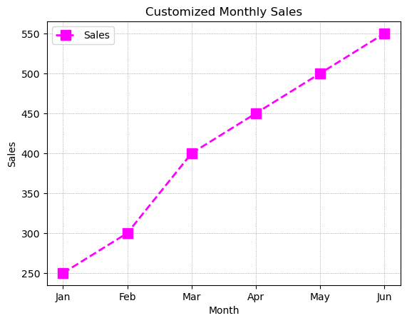
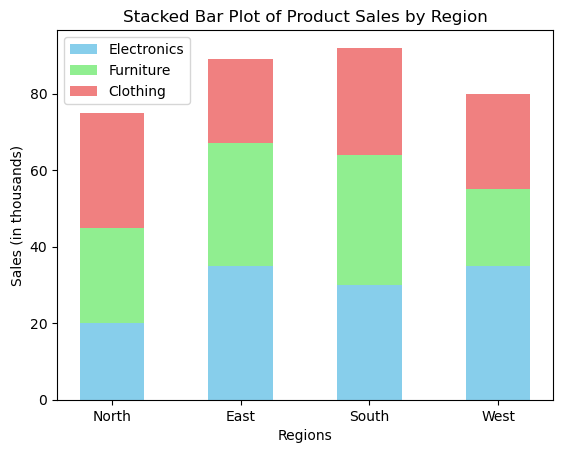

# Matplotlib
Matplotlib is a powerful Python library widely used for creating various visualizations. It supports static, dynamic, and interactive graphics in two and three dimensions. Matplotlib integrates seamlessly with NumPy and Pandas, making it ideal for scientific and exploratory data analysis.

### Why use Matplotlib?
* Visual exploration of data.
* Creation of publication-quality figures.
* Wide support for different plot types (line, bar, scatter, histogram, etc.).
* Extensive customization options for visual elements like colors, markers, and grids.


```python
# Importing Matplotlib
import matplotlib.pyplot as plt
import numpy as np
```

#### Explanation
* `matplotlib` is a comprehensive library for creating visualizations in Python.
* Within `matplotlib`, there is a submodule called `pyplot` specifically designed to simplify plotting by offering an easy-to-use interface.
* Writing `matplotlib.pyplot` repeatedly in your code can be cumbersome. To simplify the code, we use an alias—`plt`.

### Basic Terminology
* **Figure**: Container holding all elements of a plot (e.g., titles, axes, labels).
* **Axes**: Region where data is plotted, including x-axis and y-axis.


```python
# Creating an empty plot
fig, ax = plt.subplots()  # fig: container, ax: plotting region
plt.show()
```


    

    


## Line Plot
Used to represent continuous data trends over intervals or time.


```python
# Example: Monthly average sales
months = ['Jan', 'Feb', 'Mar', 'Apr', 'May', 'Jun']
sales = [250, 300, 400, 450, 500, 550]

plt.plot(months, sales)  # Line plot with markers
plt.xlabel('Months')
plt.ylabel('Sales')
plt.title('Monthly Sales Trend')
plt.grid(False)
plt.show()
```


    

    


### Customizing Plots

Matplotlib allows extensive customization:
* **Color**: Enhances visual appeal and readability.
* **Markers**: Clearly shows data points.
* **Gridlines**: Improves data readability.
* **Legends**: Clarifies plots when multiple data series exist.


```python
plt.plot(months, sales, marker='s', color='magenta', linestyle='--', linewidth=2, markersize=10, label='Sales')
plt.xlabel('Month')
plt.ylabel('Sales')
plt.title('Customized Monthly Sales')
plt.legend()
plt.grid(color='gray', linestyle=':', linewidth=0.5)
plt.show()
```


    

    


* **Marker**: Emphasizes data points ('o' for circles).
* **Linestyle ('-')**: Connects data points with solid lines.


```python
# Months for x-axis
months = ['Jan', 'Feb', 'Mar', 'Apr', 'May', 'Jun']

# Sales data for three different products
sales_A = [120, 150, 170, 200, 220, 250]
sales_B = [80, 100, 130, 150, 170, 190]
sales_C = [50, 60, 80, 90, 100, 120]

# Plotting sales data for Product A
plt.plot(months, sales_A, marker='o', color='blue', linestyle='-', linewidth=2, label='Product A')

# Plotting sales data for Product B
plt.plot(months, sales_B, marker='s', color='green', linestyle='--', linewidth=2, label='Product B')

# Plotting sales data for Product C
plt.plot(months, sales_C, marker='^', color='red', linestyle='-.', linewidth=2, label='Product C')

# Adding labels and title for clarity
plt.xlabel('Months')
plt.ylabel('Sales (in units)')
plt.title('Monthly Sales Comparison for Products A, B, and C')

# Adding grid lines to enhance readability
plt.grid(True, linestyle=':', color='grey')

# Adding legend to distinguish each product clearly
plt.legend()

# Display the plot
plt.show()
```


    

    


* Multiple line plots help visualize and directly compare the trends and patterns across multiple related datasets over a common x-axis (time or sequence).
* Markers and line styles make each line distinct, ensuring clarity even when the plot is printed in black and white.
* A legend clarifies what each line represents.
* Gridlines improve readability, making it easier to track values across the months clearly.

### Step Line Chart


```python
# Data
days = ['Mon', 'Tue', 'Wed', 'Thu', 'Fri']
prices = [100, 120, 120, 150, 170]

# Step line plot
plt.step(days, prices, where='mid', color='purple', linewidth=2)

# Labels and Title
plt.xlabel('Days of the Week')
plt.ylabel('Price ($)')
plt.title('Weekly Product Price Changes (Step Chart)')

# Grid for better visibility
plt.grid(alpha=0.6)

# Display the plot
plt.show()
```


    

    


### Line Chart with Error Bars
Displaying uncertainty or variability (e.g., Experimental results with standard deviation).


```python
# Data
time_points = ['T1', 'T2', 'T3', 'T4']
measurement = [20, 25, 23, 30]
errors = [2, 3, 1.5, 2.5]  # Standard deviation or error

# Plot with error bars
plt.errorbar(time_points, measurement, yerr=errors, fmt='-o', color='darkorange',
             ecolor='gray', elinewidth=2, capsize=5)

# Labels and Title
plt.xlabel('Time Points')
plt.ylabel('Measurements')
plt.title('Experimental Results with Error Bars')

# Display grid
plt.grid(linestyle='--', alpha=0.7)

# Show plot
plt.show()
```


    

    


## Scatter Plot
Ideal for visualizing relationships between two numeric variables, identifying clusters, and detecting outliers.


```python
# Example: Relationship between age and salary
age = [22, 25, 28, 35, 40, 45, 50, 55]
salary = [20000, 25000, 30000, 45000, 60000, 80000, 100000, 120000]

plt.scatter(age, salary, marker='^', color='green', edgecolor='black')
plt.xlabel('Age (years)')
plt.ylabel('Salary ($)')
plt.title('Age vs Salary Scatter Plot')
plt.grid(False)
plt.show()
```


    

    


* Scatter plots help in identifying the **correlation** between variables.

### Scatter Plot with Color Encoding
Distinguishing groups within data (e.g., different species of penguins).


```python
# Example data: bill length and depth of penguins
bill_length = [39, 42, 46, 50, 54, 49, 45]
bill_depth = [18, 20, 17, 15, 19, 14, 16]
species = ['Adelie', 'Adelie', 'Gentoo', 'Gentoo', 'Chinstrap', 'Chinstrap', 'Adelie']

# Assign colors to species
colors = {'Adelie': 'green', 'Gentoo': 'orange', 'Chinstrap': 'purple'}

# Scatter plot with color encoding
for i in range(len(bill_length)):
    plt.scatter(bill_length[i], bill_depth[i],
                color=colors[species[i]],
                label=species[i] if species[i] not in plt.gca().get_legend_handles_labels()[1] else "")

# Labels and title
plt.xlabel('Bill Length (mm)')
plt.ylabel('Bill Depth (mm)')
plt.title('Penguin Bill Dimensions by Species')

# Legend and grid
plt.legend()
plt.grid(alpha=0.6)

# Display plot
plt.show()
```


    

    


### Bubble Scatter Plot (size encoding)
Representing three dimensions (e.g., city population by location).


```python
# City coordinates and populations (in millions)
city_x = [20, 30, 25, 35, 40]
city_y = [40, 30, 50, 20, 45]
population = [1, 3, 2, 5, 4]

# Bubble plot with size proportional to population
plt.scatter(city_x, city_y, s=[p*100 for p in population], color='skyblue', alpha=0.7, edgecolor='black')

# Labels and title
plt.xlabel('Longitude')
plt.ylabel('Latitude')
plt.title('City Populations (Bubble Size = Population)')

# Grid
plt.grid(True, linestyle='--', alpha=0.6)

# Display plot
plt.show()
```


    

    


### Scatter Plot with Transparency
Clearly visualizing data density or overlap (e.g., overlapping survey responses).


```python
# Generate random data (large dataset)
x = np.random.normal(0, 1, 500)
y = np.random.normal(0, 1, 500)

# Scatter plot with transparency
plt.scatter(x, y, alpha=0.3, color='red')

# Labels and title
plt.xlabel('X values')
plt.ylabel('Y values')
plt.title('Scatter Plot with Transparency')

# Grid
plt.grid(True, linestyle='--')

# Display
plt.show()

```


    

    


### Scatter Plot with Marker Styles
Distinguishing multiple data series using different marker styles.


```python
# Data: Age vs Salary by Job Role
age_dev = [25, 30, 35, 40]
salary_dev = [50000, 60000, 70000, 80000]

age_mgmt = [28, 35, 42, 50]
salary_mgmt = [60000, 75000, 90000, 110000]

# Scatter plot for different job roles with unique markers
plt.scatter(age_dev, salary_dev, marker='o', color='blue', label='Developer')
plt.scatter(age_mgmt, salary_mgmt, marker='^', color='green', label='Manager')

# Labels and title
plt.xlabel('Age (years)')
plt.ylabel('Salary ($)')
plt.title('Salary by Age and Job Role')

# Legend and grid
plt.legend()
plt.grid(True, alpha=0.5)

# Display plot
plt.show()
```


    

    


### Scatter Plot with Trend Line (Linear Fit)
Scenario: Visualizing correlation and trend clearly (e.g., sales growth).


```python
# Data
months = np.array([1, 2, 3, 4, 5, 6])
sales = np.array([50, 55, 65, 70, 80, 85])

# Scatter plot
plt.scatter(months, sales, color='purple', label='Actual Sales')

# Add linear trend line
m, b = np.polyfit(months, sales, 1) # linear fit
plt.plot(months, m*months + b, color='black', linestyle='--', label='Trend Line')

# Labels and title
plt.xlabel('Months')
plt.ylabel('Sales')
plt.title('Monthly Sales with Trend Line')

# Legend and grid
plt.legend()
plt.grid(alpha=0.6)

# Display plot
plt.show()
```


    

    


## Bar Plot
Useful for comparing categorical data.


```python
# Example: Population in cities
cities = ['Delhi', 'Mumbai', 'Kolkata', 'Chennai', 'Bangalore']
population = [30, 25, 15, 12, 10]

plt.bar(cities, population, color='skyblue', edgecolor='navy')
plt.xlabel('Cities')
plt.ylabel('Population (Millions)')
plt.title('Population by City')
plt.show()
```


    

    


### Horizontal Bar Plot

Helpful when category names are lengthy.


```python
# Example: Revenue of companies
companies = ['Google', 'Amazon', 'Microsoft', 'Apple']
revenue = [160, 280, 140, 260]

plt.barh(companies, revenue, color='orange')
plt.xlabel('Revenue (Billions $)')
plt.title('Company Revenue Comparison')
plt.show()
```


    

    


```python
# Define categories and regions
regions = ['North', 'East', 'South', 'West']

# Sales data for each product category in each region
electronics_sales = [20, 35, 30, 35]
furniture_sales = [25, 32, 34, 20]
clothing_sales = [30, 22, 28, 25]

# Create positions for the bars on x-axis
bar_width = 0.5
x_positions = np.arange(len(regions))

# Create the stacked bars
plt.bar(x_positions, electronics_sales, width=bar_width, label='Electronics', color='skyblue')
plt.bar(x_positions, furniture_sales, width=bar_width, bottom=electronics_sales, label='Furniture', color='lightgreen')

# To stack Clothing on top, sum Electronics and Furniture sales for bottom position
bottom_positions = np.array(electronics_sales) + np.array(furniture_sales)
plt.bar(x_positions, clothing_sales, width=bar_width, bottom=bottom_positions, label='Clothing', color='lightcoral')

# Adding labels and title for better readability
plt.xlabel('Regions')
plt.ylabel('Sales (in thousands)')
plt.title('Stacked Bar Plot of Product Sales by Region')

# Adding region names as x-tick labels
plt.xticks(x_positions, regions)

# Adding a legend to show product categories
plt.legend()

# Display the plot
plt.show()
```


    

    


* **Stacking bars (bottom)**:
* The bottom parameter in the second and third plt.bar() calls specifies the position where each bar should start stacking.
* First, you plot the base bars (Electronics), then stack Furniture on top of Electronics, and finally, stack Clothing on top of the combined sales of Electronics and Furniture.
* **Why use Stacked Bar Plots?**
* Clearly shows total sales per region.
* Easily visualize the individual contribution of each product category to the total sales.

### Grouped Bar plot


```python
import matplotlib.pyplot as plt
import numpy as np

# Years and company revenue data (in million dollars)
years = ['2020', '2021', '2022', '2023']
revenue_x = [50, 60, 70, 85]  # Company X revenue
revenue_y = [40, 65, 80, 90]  # Company Y revenue

# Define the bar width
bar_width = 0.35

# Set positions of bars on x-axis for both companies
x_positions = np.arange(len(years))

# Plotting the bars side-by-side
plt.bar(x_positions - bar_width/2, revenue_x, width=bar_width, color='skyblue', label='Company X')
plt.bar(x_positions + bar_width/2, revenue_y, width=bar_width, color='salmon', label='Company Y')

# Adding labels and titles for clarity
plt.xlabel('Year')
plt.ylabel('Revenue (Million $)')
plt.title('Annual Revenue Comparison between Company X and Company Y')

# Adding year labels to x-axis ticks
plt.xticks(x_positions, years)

# Adding a legend for clear distinction
plt.legend()

# Adding grid lines for readability
plt.grid(axis='y', linestyle='--', alpha=0.7)

# Display the plot
plt.show()
```


    

    


## Basic Pie Chart

* Pie charts visually illustrate proportions or percentages effectively.
* They're ideal for simple categorical breakdowns where the number of categories is relatively small (typically less than 6).
* They are not recommended for precise comparisons (bar plots are better for accurate comparisons).


```python
# Data
regions = ['North', 'South', 'East', 'West']
sales = [30, 25, 20, 25]

# Creating basic pie chart
plt.pie(sales, labels=regions, autopct='%1.1f%%', colors=['skyblue', 'lightgreen', 'orange', 'pink'])

# Title
plt.title('Sales Distribution by Region')

# Show plot
plt.show()
```


    

    


### Pie Chart with Exploded Slice


```python
# Example: Market share of smartphone brands
brands = ['Samsung', 'Apple', 'Xiaomi', 'Vivo', 'Others']
shares = [22, 20, 18, 15, 25]
explode = [0.2, 0, 0, 0, 0]  # emphasize Samsung

plt.pie(shares, labels=brands, autopct='%1.1f%%', explode=explode, shadow=True)
plt.title('Smartphone Market Share')
plt.show()
```


    

    


### Donut Pie Chart
Useful for visually appealing data representations and for adding additional text/information in the center.


```python
# Data
categories = ['Electronics', 'Clothing', 'Furniture', 'Food']
revenue = [35, 25, 20, 20]

# Create donut pie chart
plt.pie(revenue, labels=categories, autopct='%1.1f%%', colors=['#66b3ff','#99ff99','#ffcc99','#ff6666'], wedgeprops={'width':0.4})

# Add center circle
plt.gca().add_artist(plt.Circle((0,0),0.7,fc='white'))

# Title
plt.title('Revenue Distribution by Product Categories')

plt.show()
```


    

    


### Pie Chart with Customized Legend and Colors


```python
brands = ['Samsung', 'Apple', 'Xiaomi', 'Others']
market_share = [32, 30, 20, 18]

colors = ['gold', 'silver', 'orange', 'lightgrey']

# Pie chart with no labels, custom legend instead
plt.pie(market_share, colors=colors, autopct='%1.1f%%', startangle=140)

# Custom legend
plt.legend(brands, title='Brands', loc='center left', bbox_to_anchor=(1, 0.5))

plt.title('Smartphone Market Share')
plt.show()
```


    

    


## Histogram

Visualizes distribution and frequency of numerical data.


```python
# Generate random data for ages
ages = np.random.normal(40, 8, 200)

plt.hist(ages, bins=15, color='purple', edgecolor='black')
plt.xlabel('Age')
plt.ylabel('Frequency')
plt.title('Age Distribution')
plt.grid(axis='y', linestyle='--',  alpha=0.5)
plt.show()
```


    

    


Useful for seeing data distribution and detecting skewness.

### Histogram with Custom Bin Width
Test scores grouped into fixed ranges (bin width = 10).


```python
# Generate test scores
scores = np.random.normal(70, 10, 200)  # mean=70, std=10

# Custom bin range from 40 to 100, in steps of 10
bins = np.arange(40, 101, 10)

# Histogram with custom bins
plt.hist(scores, bins=bins, color='orange', edgecolor='black')
plt.xlabel('Score Range')
plt.ylabel('Number of Students')
plt.title('Student Performance')
plt.grid(axis='y', linestyle=':')
plt.show()
```


    

    


### Histogram with Density Curve
Visualize the shape of a continuous distribution like weight.


```python
from scipy.stats import gaussian_kde

# Simulated weight data
weights = np.random.normal(loc=65, scale=8, size=300)

# Histogram
count, bins, _ = plt.hist(weights, bins=15, color='lightgreen', edgecolor='black', alpha=0.6, density=True)

# Density curve using Gaussian KDE
density = gaussian_kde(weights)
x_vals = np.linspace(min(weights), max(weights), 200)
plt.plot(x_vals, density(x_vals), color='darkgreen', linewidth=2, label='KDE Curve')

# Labels and title
plt.xlabel('Weight (kg)')
plt.ylabel('Density')
plt.title('Weight Distribution with Density Curve')
plt.grid(True, linestyle='--', alpha=0.5)
plt.legend()

# Show the plot
plt.show()
```


    

    


### Overlapping Histograms
Comparing weight distribution between two groups (e.g., male vs female).


```python
# Weight data for two groups
group_m = np.random.normal(70, 5, 200)
group_f = np.random.normal(60, 5, 200)

# Plot overlapping histograms
plt.hist(group_m, bins=15, alpha=0.6, label='Male', color='blue', edgecolor='black')
plt.hist(group_f, bins=15, alpha=0.6, label='Female', color='red', edgecolor='black')

plt.xlabel('Weight (kg)')
plt.ylabel('Frequency')
plt.title('Weight Distribution by Gender')
plt.legend()
plt.grid(True)
plt.show()
```


    

    


### Stacked Histogram
Income groups across different cities.


```python
# Income levels in 3 cities
city1 = np.random.normal(40000, 5000, 200)
city2 = np.random.normal(45000, 5000, 200)
city3 = np.random.normal(50000, 5000, 200)

# Stacked histogram
plt.hist([city1, city2, city3], bins=15, stacked=True, label=['City A', 'City B', 'City C'],
         color=['cyan', 'orange', 'lime'], edgecolor='black')

plt.xlabel('Annual Income')
plt.ylabel('Number of People')
plt.title('Stacked Income Distribution Across Cities')
plt.legend()
plt.grid(True, linestyle='--', alpha=0.5)
plt.show()
```


    

    


Great for understanding cumulative composition from multiple groups.

### Horizontal Histogram
Frequency of product purchases.


```python
# Simulated purchase frequency
purchase_counts = np.random.poisson(3, 100)

# Horizontal histogram
plt.hist(purchase_counts, bins=10, orientation='horizontal', color='magenta', edgecolor='black')
plt.ylabel('Number of Purchases')
plt.xlabel('Frequency')
plt.title('Distribution of Purchase Counts')
plt.grid(axis='x', linestyle='--')
plt.show()
```


    

    


### Cumulative Histogram
Scenario: Cumulative exam scores to show how many students scored below a threshold.


```python
# Simulated test scores
exam_scores = np.random.normal(70, 10, 300)

# Cumulative histogram
plt.hist(exam_scores, bins=20, cumulative=True, color='teal', edgecolor='black')
plt.xlabel('Score')
plt.ylabel('Cumulative Number of Students')
plt.title('Cumulative Distribution of Exam Scores')
plt.grid(True)
plt.show()

```


    

    


Helps you see cumulative trends, such as how many people fall below a certain value.

## Basic Boxplot

* Summarizes data distribution with quartiles and identifies outliers.
* Visualize the distribution of test scores.


```python
# Generate test score data
scores = np.random.normal(75, 10, 100)

# Basic boxplot
plt.boxplot(scores, patch_artist=True)
plt.ylabel('Scores')
plt.title('Distribution of Test Scores')
plt.grid(True, axis='y', linestyle='--', alpha=0.6)
plt.show()
```


    

    


```python
# Boxplot of random data
data = [np.random.normal(50, 10, 100), np.random.normal(60, 15, 100)]

plt.boxplot(data, labels=['Group 1', 'Group 2'], patch_artist=True)
plt.ylabel('Values')
plt.title('Comparison of Two Groups')
plt.show()
```


    

    


### Horizontal Boxplot
Compare response times across three tools.


```python
tool_1 = np.random.normal(4, 1, 100)
tool_2 = np.random.normal(5, 1.5, 100)
tool_3 = np.random.normal(3.5, 0.8, 100)

# Horizontal boxplot
plt.boxplot([tool_1, tool_2, tool_3],
            patch_artist=True,
            vert=False,
            labels=['Tool 1', 'Tool 2', 'Tool 3'],
            boxprops=dict(facecolor='lightgreen'))

plt.xlabel('Response Time (s)')
plt.title('Tool Response Time Comparison')
plt.grid(True, axis='x', linestyle='--', alpha=0.6)
plt.show()
```


    

    


### Boxplot with Custom Colors per Box
Display productivity across departments with styled visuals.


```python
departments = ['HR', 'Finance', 'IT', 'Sales']
data = [np.random.normal(loc, 5, 100) for loc in [50, 60, 65, 70]]

# Create boxplot
box = plt.boxplot(data, patch_artist=True, labels=departments)

# Color each box individually
colors = ['lightblue', 'lightgreen', 'lightpink', 'lightyellow']
for patch, color in zip(box['boxes'], colors):
    patch.set_facecolor(color)

plt.ylabel('Productivity Score')
plt.title('Departmental Productivity')
plt.grid(True, axis='y', linestyle=':')
plt.show()
```


    

    


Adds visual clarity and aesthetic appeal when comparing multiple categories.

### Boxplot with Notches
Check confidence interval overlap for medians.


```python
group_1 = np.random.normal(60, 10, 100)
group_2 = np.random.normal(65, 10, 100)

# Boxplot with notches
plt.boxplot([group_1, group_2],
            notch=True,
            patch_artist=True,
            labels=['Group 1', 'Group 2'],
            boxprops=dict(facecolor='lightcoral'))

plt.ylabel('Values')
plt.title('Comparison of Groups with Notches')
plt.grid(True, axis='y', linestyle='--')
plt.show()
```


    

    


Notches help visually infer statistical significance between medians (approximate 95% CI).

### Boxplot with Custom Outliers
Scenario: Highlight and customize outlier appearance.


```python
data = np.append(np.random.normal(70, 5, 95), [100, 105, 110])  # Add extreme outliers

plt.boxplot(data,
            flierprops=dict(marker='x', markerfacecolor='red', markeredgecolor='black', markersize=8))

plt.title('Boxplot with Custom Outliers')
plt.ylabel('Values')
plt.grid(True, axis='y', linestyle='--')
plt.show()
```


    

    


Useful when you want outliers to stand out more visibly in a report.

### Area Chart
* Showing accumulated values visually (e.g., Monthly revenue).


```python
# Data
months = ['Jan', 'Feb', 'Mar', 'Apr', 'May', 'Jun']
revenue = [50, 75, 90, 120, 150, 180]

# Area under the line filled
plt.fill_between(months, revenue, color='skyblue', alpha=0.5)
plt.plot(months, revenue, marker='o', color='navy')

# Labels and Title
plt.xlabel('Months')
plt.ylabel('Revenue ($K)')
plt.title('Monthly Revenue Growth (Area Chart)')

# Display grid
plt.grid(linestyle='--', alpha=0.5)

# Show the plot
plt.show()
```


    

    


Excellent for comparing distributions and identifying outliers.

## Subplots

Multiple plots in one figure for comparative analysis.


```python
# Data for each product (Sales in Thousands)
quarters = ['Q1', 'Q2', 'Q3', 'Q4']
sales_A = [15, 20, 18, 25]
sales_B = [22, 28, 30, 35]
sales_C = [10, 15, 20, 22]

# Create figure with 1 row and 3 columns
fig, axs = plt.subplots(1, 3, figsize=(15, 4))

# Plot Product A Sales
axs[0].bar(quarters, sales_A, color='lightblue', edgecolor='navy')
axs[0].set_title('Product A Sales')
axs[0].set_xlabel('Quarter')
axs[0].set_ylabel('Sales (Thousands)')

# Plot Product B Sales
axs[1].bar(quarters, sales_B, color='lightgreen', edgecolor='green')
axs[1].set_title('Product B Sales')
axs[1].set_xlabel('Quarter')
axs[1].set_ylabel('Sales (Thousands)')

# Plot Product C Sales
axs[2].bar(quarters, sales_C, color='lightcoral', edgecolor='red')
axs[2].set_title('Product C Sales')
axs[2].set_xlabel('Quarter')
axs[2].set_ylabel('Sales (Thousands)')

# Improve spacing between subplots
plt.tight_layout()

# Display the plot
plt.show()
```


    

    


#### Explanation:
* **Purpose of using subplots**:
When you have data of similar types (here, quarterly sales), it helps to compare them clearly by placing each in its own subplot.

* **Why Bar Charts**:
Bar charts clearly represent categorical comparisons, making it easy to see differences in sales per quarter for each product.

* `figsize=(15,4)`:
Adjusts the overall figure size, providing better visibility.

* `plt.tight_layout()`:
Automatically adjusts spacing between subplots, preventing overlapping labels and titles.

## Heatmap (2D color-coded matrix)
Use case: Visualizing correlation matrices or intensity grids.


```python
data = np.random.rand(6, 6)

plt.imshow(data, cmap='viridis', interpolation='nearest')
plt.colorbar(label='Intensity')
plt.title('Heatmap Example')
plt.show()
```


    

    


Great for showing relationships between variables (like correlation matrices).

## Stackplot (Stacked Area Plot)
* Showing part-to-whole changes over time.


```python
days = [1, 2, 3, 4, 5]
product_A = [3, 4, 5, 4, 3]
product_B = [1, 1, 2, 3, 4]
product_C = [2, 3, 4, 2, 1]

plt.stackplot(days, product_A, product_B, product_C, labels=['A', 'B', 'C'], alpha=0.8)
plt.legend(loc='upper left')
plt.title('Product Sales Stackplot')
plt.xlabel('Day')
plt.ylabel('Units Sold')
plt.show()
```


    

    


## Polar Plot
Directional or circular data (e.g., wind direction, radar).


```python
theta = np.linspace(0, 2 * np.pi, 100)
r = np.abs(np.sin(theta) * 10)

plt.polar(theta, r, color='teal')
plt.title('Polar Plot Example')
plt.show()
```


    

    


Ideal for periodic or angular data.`

## Quiver Plot (Vector Field)
Displaying vector fields (e.g., wind flow, gradients).


```python
X, Y = np.meshgrid(np.arange(-2, 2, 0.2), np.arange(-2, 2, 0.2))
U = -Y
V = X

plt.quiver(X, Y, U, V)
plt.title('Vector Field - Quiver Plot')
plt.xlabel('X')
plt.ylabel('Y')
plt.grid(True)
plt.show()
```


    

    


Useful in physics, engineering, and gradient visualization.

## 3D Plots (Axes3D)
Use case: Visualizing functions of 3 variables or spatial data.


```python
from mpl_toolkits.mplot3d import Axes3D

fig = plt.figure()
ax = fig.add_subplot(111, projection='3d')

x = np.linspace(-5, 5, 30)
y = np.linspace(-5, 5, 30)
x, y = np.meshgrid(x, y)
z = np.sin(np.sqrt(x**2 + y**2))

ax.plot_surface(x, y, z, cmap='viridis')
plt.title('3D Surface Plot')
plt.show()
```


    

    


## Saving plots:


```python
plt.plot(months, sales)
plt.savefig('sales_plot.png', dpi=300)  # High-resolution image
```


    

    

