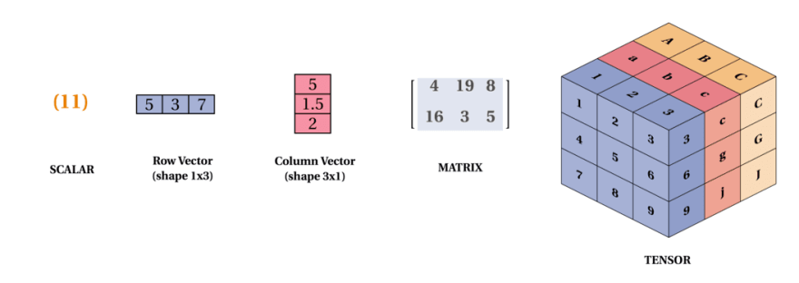
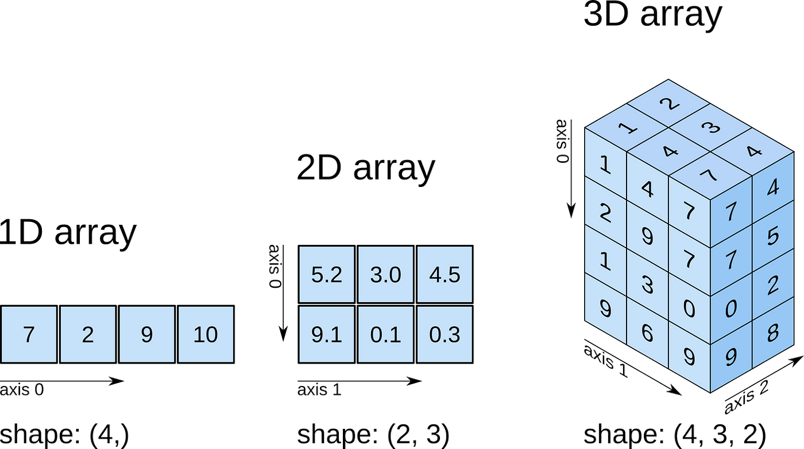
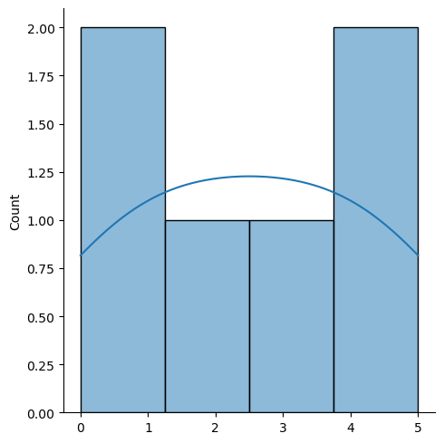
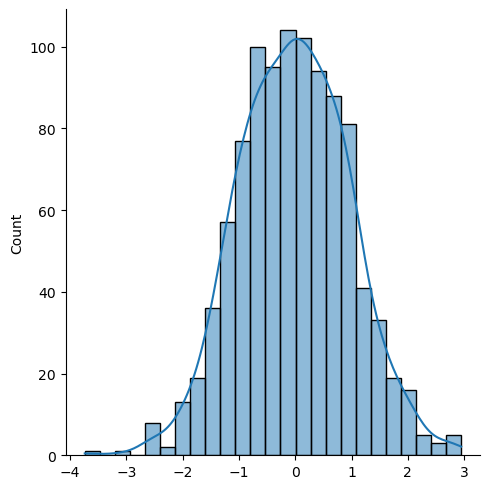
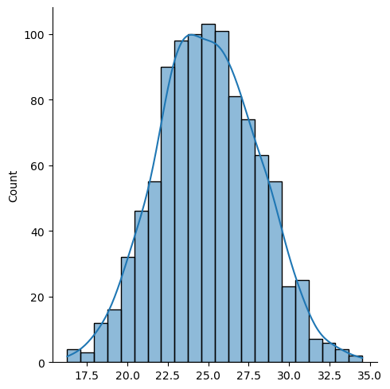

# NumPy

**NumPy** (short for **Numerical Python**) is a powerful **open-source Python library** used for numerical computations. It provides support for:

* **Multidimensional arrays and matrices**.
* A wide variety of **mathematical operations** on these arrays.
* Efficient computations that are **faster and more memory-optimized** than native Python lists.

**NumPy forms the backbone of scientific computing in Python. Libraries like pandas, scikit-learn, TensorFlow, and PyTorch internally use NumPy**.

#### Installing numPy
pip install numpy

#### Import NumPy using keyword **import**
import numpy

#### NumPy as **np** as alias


```python
# Import numpy library
import numpy as np
```

### Check NumPy version


```python
print(np.__version__)
```

    1.21.5
    

## Why do we need NumPy?
* Lists are similar to arrays but slow in process.
* NumPy is upto 50x faster than traditional python lists.
* NumPy arrays are stored at one continuous place in memory. unlike liksts, so can access and manipulate them very efficiently.
* Mostly written in C or C++, partially in python.
* The source code for NumPy is located at this github repository https://github.com/numpy/numpy


```python
import time

# Python list
lst = list(range(1_000_000))
start = time.time()
lst = [x * 2 for x in lst]
print("List time:", time.time() - start)

# NumPy array
arr = np.arange(1_000_000)
start = time.time()
arr = arr * 2
print("NumPy time:", time.time() - start)

```

    List time: 0.12334966659545898
    NumPy time: 0.008526086807250977
    

## Data structures
- Scalar
- Vector
- Arrays 
- Matrix (built in)



**Image source**: https://medium.com/geekculture/numpy-in-9-minutes-cd7c366c0538

#### Arrays:
- A numpy Array is a collection of common type of data structures having elements with same data type. 
- It is indexed by a tuple of non-negative integers.
- It is used to store collections of data. 
- In Python programming, an arrays are handled by the “array” module. 
- If you create arrays using the array module, elements of the array must be of the same data type.

NumPy is used for working with an array.

#### Number of dimensions (a.ndim)
- The number of dimensions is the rank of array

#### Shape of an array (a.shape)
- The shape of any array is tuple of integers giving the size of the array along each dimension.

#### Size of an array (a.size)
- how many values there are in the array using the size attribute

### Creating an array
* NumPy is used to work with arrays. The array object in NumPy is called **ndarray**
* array() function can be used to create ndarray objects.


```python
Array_var = np.array([1, 2, 3, 4, 5]) # creating an array
print(Array_var)
print(type(Array_var))
```

    [1 2 3 4 5]
    <class 'numpy.ndarray'>
    

## Dimensions in Arrays

### 0-D Arrays
* Scalars


```python
ar = np.array(5)
print(ar)
```

    5
    

### 1-D arrays or Vector
* Uni-dimensional, most common basic arrays.


```python
ar_1D = np.array([1, 2, 3, 4, 5])
print(ar_1D)
```

    [1 2 3 4 5]
    

### 2-D arrays
* Has 1-D arrays as it elements called 2-D array.
* Often used to represent matrix or 2nd order tensors.
* Submodule dedicated towards matrix operations called **numpy.mat**


```python
ar_2d = np.array([[1, 2, 3], [4, 5, 6]])
print(ar_2d)
```

    [[1 2 3]
     [4 5 6]]
    

### Transposition


```python
print(ar_2d.T)
```

    [[1 4]
     [2 5]
     [3 6]]
    

### 3-d arrays
* 2-d arrays as its elements.
* Often used to represent a 3rd order tensor.


```python
ar_3d = np.array([[[1, 2, 3], [4, 5, 6], [7, 8, 9]]])
print(ar_3d)
```

    [[[1 2 3]
      [4 5 6]
      [7 8 9]]]
    

### Check number of dimensions **ndim**


```python
print(ar.ndim)
print(ar_1D.ndim)
print(ar_2d.ndim)
print(ar_3d.ndim)
```

    0
    1
    2
    3
    

### Check number of elements/size


```python
print(ar.size)
print(ar_1D.size)
print(ar_2d.size)
print(ar_3d.size)
```

    1
    5
    6
    9
    

### Checking shape of an array
* Shape of an array is the number of elements in each dimension.



**Image source**: https://bigfundu.medium.com/numpy-basics-4-fbd93ab72164


```python
print(ar.shape)
print(ar_1D.shape)
print(ar_2d.shape)
print(ar_3d.shape)
```

    ()
    (5,)
    (2, 3)
    (1, 3, 3)
    


```python
# Create an array with 5 dimensions using ndmin using a vector with values 1,2,3,4 and verify that last dimension has value 4:
arr = np.array([1, 2, 3, 4], ndmin = 5)
print(arr)
print('shape of array :', arr.shape)
```

    [[[[[1 2 3 4]]]]]
    shape of array : (1, 1, 1, 1, 4)
    

Integers at every index tells about the number of elements the corresponding dimension has.

In the example above at index-4 we have value 4, so we can say that 5th ( 4 + 1 th) dimension has 4 elements.


### Higher dimension array
* An array can have number of dimensions.
* When the array is created, you can define the number of dimensions by using the **ndmin** argument.


```python
ar_nd = np.array([1, 2, 3, 4, 5], ndmin = 5)
print('number of dimensions :', ar_nd.ndim)
```

    number of dimensions : 5
    

## Indexing
* Same as array element.
* Can be done by using index number.
* Indexing starts with 0 in python.

### Access 1 d array


```python
ar_1D = np.array([11, 12, 13, 14, 15])
# getting the first element
print(ar_1D[0])
# getting the second element
print(ar_1D[1])
```

    11
    12
    


```python
# get 3rd and 4th element
print(ar_1D[2], ar_1D[3])
```

    13 14
    

### Access 2 d array


```python
ar_2d = np.array([[1, 2, 3, 4, 5], [6, 7, 8, 9, 10]])
print(ar_2d)
```

    [[ 1  2  3  4  5]
     [ 6  7  8  9 10]]
    


```python
# Access number 3
print(ar_2d[0, 2])
```

    3
    


```python
# 3rd element of 2nd row
print('3rd element of 2nd rows: ', ar_2d[1, 2])
```

    3rd element of 2nd rows:  8
    

### Access 3-D array


```python
arr = np.array([[[1, 2, 3], [4, 5, 6]], [[7, 8, 9], [10, 11, 12]]])
print(arr)
```

    [[[ 1  2  3]
      [ 4  5  6]]
    
     [[ 7  8  9]
      [10 11 12]]]
    


```python
# Access the third element of the second array of the first array
print(arr[0, 1, 2])
```

    6
    

arr[0, 1, 2] prints the value 6.

And this is why:

The first number represents the first dimension, which contains two arrays:
[[1, 2, 3], [4, 5, 6]]
and:
[[7, 8, 9], [10, 11, 12]]
Since we selected 0, we are left with the first array:
[[1, 2, 3], [4, 5, 6]]

The second number represents the second dimension, which also contains two arrays:
[1, 2, 3]
and:
[4, 5, 6]
Since we selected 1, we are left with the second array:
[4, 5, 6]

The third number represents the third dimension, which contains three values:
4
5
6
Since we selected 2, we end up with the third value:
6

### Negative indexing


```python
print(ar_2d)

```

    [[ 1  2  3  4  5]
     [ 6  7  8  9 10]]
    


```python
# last element from the 2nd dimension
print(ar_2d[1, -1])
```

    10
    

## Slicing
* It means taking elements from one given index to another given index.
* Slicing can be done like [start:stop] or [start:stop:step]
* If we do not pass start it means 0
* If we do not pass end it means length of array
* If we do not define step considered as 1.


```python
arr = np.array([1, 2, 3, 4, 5, 6, 7])
# slice elements from index 1 to index 5 from the following array:
print(arr[1:5])
```

    [2 3 4 5]
    


```python
# slice elements from index 4 to end of the array
print(arr[4:])
```

    [5 6 7]
    


```python
# slice elements from the begining to index 4(not included)
print(arr[:4])
```

    [1 2 3 4]
    

### Negative slicing


```python
# slice from the index 3 from the index 1
print(arr[-3: -1])
```

    [5 6]
    

### Step


```python
# return every other element from index 1 to index 5:
print(arr[1:5:2])
```

    [2 4]
    


```python
# return every other elements
print(arr[::2])
```

    [1 3 5 7]
    

### Slicing 2 d arrays


```python
arr = np.array([[1, 2, 3, 4, 5], [6, 7, 8, 9, 10]])
print(arr)
```

    [[ 1  2  3  4  5]
     [ 6  7  8  9 10]]
    


```python
# From the second element, slice elements from index 1 to index 4 (not included)
print(arr[1, 1:4])
```

    [7 8 9]
    


```python
# from both elements, return index 2
print(arr[0:2, 2])
```

    [3 8]
    


```python
# from both elements, slice index 1 to index 4 (not included), this will return a 2-D array
print(arr[0:2, 1:4])
```

    [[2 3 4]
     [7 8 9]]
    

## NumPy data types
* Data types in python:
  * strings- "name"
  * integer- 1, 2, -3
  * float- 1.2, 4.2
  * boolean- True, False
  * complex- 1.0 + 2.0j

* i - integer
* b - boolean
* u - unsigned integer
* f - float
* c - complex float
* m - timedelta
* M - datetime
* O - object
* S - string
* U - unicode string
* V - fixed chunk of memory for other type

#### Check data type in python
* **dtype**


```python
a = np.array([1, 2, 3, 4])
print(a.dtype)
```

    int32
    


```python
stri = np.array(['apple', 'banana', 'cherry'])
print(stri.dtype)
```

    <U6
    

#### Creating arrays with a defined data type


```python
a = np.array([1, 2, 3, 4, 5], dtype = 'S')
print(a)
print(a.dtype)
```

    [b'1' b'2' b'3' b'4' b'5']
    |S1
    

#### Value cannot be converted  
* It will throw value error


```python
arr = np.array(['a', '2', '3'], dtype='i')
```


    ---------------------------------------------------------------------------

    ValueError                                Traceback (most recent call last)

    ~\AppData\Local\Temp\ipykernel_23288\3318528490.py in <module>
    ----> 1 arr = np.array(['a', '2', '3'], dtype='i')
    

    ValueError: invalid literal for int() with base 10: 'a'


#### Converting data type on existing array
* The best way to change the data type of an existing array, is to make a copy of the array with the **astype()** method.
* The astype() function creates a copy of the array, and allows you to specify the data type as a parameter.


```python
arr = np.array([1.1, 1.2, 1.3])
arr_int = arr.astype(int) # or 'i'
print(arr_int)
print(arr_int.dtype)
```

    [1 1 1]
    int32
    


```python
arr = np.array([0, 1, 2])
arr_bool = arr.astype(bool)
print(arr_bool)
print(arr_bool.dtype)
```

    [False  True  True]
    bool
    

## NumPy Array Copy and View
### The difference between copy and view
* The main difference between a copy and a view of an array is that the copy is a new array, and the view is just a view of the original array.


```python
import numpy as np
arr = np.array([1, 2, 3, 4, 5])
# copy
x = arr.copy()
arr[0] = 42

print(arr)
print(x)
```

    [42  2  3  4  5]
    [1 2 3 4 5]
    


```python
arr = np.array([1, 2, 3, 4, 5])
# view
x = arr.view()
arr[0] = 42

print(arr)
print(x)
```

    [42  2  3  4  5]
    [42  2  3  4  5]
    

## NumPy Array and Reshaping
* Changing the shape of array.
* The shape of an array is the number of elements in each dimension.


**Image source**: https://numpy.org/devdocs/user/absolute_beginners.html


```python
arr = np.array([1, 2, 3, 4, 5, 6])
```


```python
print(arr.reshape(2, 3))
```

    [[1 2 3]
     [4 5 6]]
    


```python
print(arr.reshape(3, 2))
```

    [[1 2]
     [3 4]
     [5 6]]
    

## NumPy Array Iterating
* Iterating means going through elements one by one.


```python
arr = np.array([1, 2, 3])
for x in arr:
  print(x)
```

    1
    2
    3
    


```python
arr_2d = np.array([[1, 2, 3], [3, 4, 5]])
for x in arr_2d:
  print(x)
```

    [1 2 3]
    [3 4 5]
    


```python
# iterate on each scalar element of the 2-D array
for x in arr_2d:
  for y in x:
    print(y)
```

    1
    2
    3
    3
    4
    5
    

### Iterating arrays using nditer()
* nditer() is a helping function that can be used from very basic to very advanced iteration.


```python
arr = np.array([[[1, 2], [3, 4], [5, 6], [7, 8]]])
for x in np.nditer(arr):
  print(x)
```

    1
    2
    3
    4
    5
    6
    7
    8
    


```python
# Iterating Array With Different Data Types
arr = np.array([1, 2, 3])

for x in np.nditer(arr, flags=['buffered'], op_dtypes=['S']):
  print(x)
```

    b'1'
    b'2'
    b'3'
    

### Enumerated Iteration Using ndenumerate()
* Enumeration means mentioing sequence number of somethings one by one.


```python
arr = np.array([1, 2, 3])

for idx, x in np.ndenumerate(arr):
  print(idx, x)
```

    (0,) 1
    (1,) 2
    (2,) 3
    

## NumPy Joining Array
* putting contents of two or more arrays in a single array.
* In numPy we join arrays by axes.
* concatenate()


```python
arr1 = np.array([1, 2, 3])
arr2 = np.array([4, 5, 6])

arr = np.concatenate((arr1, arr2))
print(arr)
```

    [1 2 3 4 5 6]
    


```python
# Join two 2-D arrays along rows (axis=1):
arr1 = np.array([[1, 2], [3, 4]])
arr2 = np.array([[5, 6], [7, 8]])

arr=np.concatenate((arr1, arr2), axis=1)
print(arr)

```

    [[1 2 5 6]
     [3 4 7 8]]
    


```python
# Join two 2-D arrays along columns (axis=0):
arr1 = np.array([[1, 2], [3, 4]])
arr2 = np.array([[5, 6], [7, 8]])

arr=np.concatenate((arr1, arr2), axis=0)
print(arr)
```

    [[1 2]
     [3 4]
     [5 6]
     [7 8]]
    

### Joining Arrays Using **Stack** Functions
* Stacking same as concatenation, the only difference is that stacking is done along a new axis.


```python
arr1 = np.array([1, 2, 3])
arr2 = np.array([4, 5, 6])

arr = np.stack((arr1, arr2), axis=1)
print(arr)
```

    [[1 4]
     [2 5]
     [3 6]]
    

### stacking along rows:
* helper function **hstack()**


```python
arr1 = np.array([1, 2, 3])
arr2 = np.array([4, 5, 6])

arr = np.hstack((arr1, arr2))
print(arr)
```

    [1 2 3 4 5 6]
    

### stacking along columns
* helper function **vstack()**


```python
arr1 = np.array([1, 2, 3])
arr2 = np.array([4, 5, 6])

arr = np.vstack((arr1, arr2))
print(arr)
```

    [[1 2 3]
     [4 5 6]]
    

### Stacking along height (depth)
* helper function **dstack()**


```python
arr1 = np.array([1, 2, 3])
arr2 = np.array([4, 5, 6])

arr = np.dstack((arr1, arr2))
print(arr)
```

    [[[1 4]
      [2 5]
      [3 6]]]
    

## NumPy splitting Array
* Splitting is reverse operation of joining.
* It breaks one array into multiple.
* **array_split()**


```python
import numpy as np
arr= np.array([1, 2, 3, 4, 5, 6])

spl_arr=np.array_split(arr, 3)
print(arr)
print(spl_arr)
```

    [1 2 3 4 5 6]
    [array([1, 2]), array([3, 4]), array([5, 6])]
    


```python
spl_arr = np.array_split(arr, 4)
print(spl_arr)
```

    [array([1, 2]), array([3, 4]), array([5]), array([6])]
    

### Splitting 2d arrays


```python
arr = np.array([[1, 2], [3, 4], [5, 6], [7, 8], [9, 10], [11, 12]])
spl_arr=np.array_split(arr, 3)
print(spl_arr)
```

    [array([[1, 2],
           [3, 4]]), array([[5, 6],
           [7, 8]]), array([[ 9, 10],
           [11, 12]])]
    

Returns 3 2-D array.

**hsplit** opposite of hstack


```python
arr = np.array([[1, 2, 3], [4, 5, 6], [7, 8, 9], [10, 11, 12], [13, 14, 15], [16, 17, 18]])
spl_arr=np.hsplit(arr, 3)
print(spl_arr)
```

    [array([[ 1],
           [ 4],
           [ 7],
           [10],
           [13],
           [16]]), array([[ 2],
           [ 5],
           [ 8],
           [11],
           [14],
           [17]]), array([[ 3],
           [ 6],
           [ 9],
           [12],
           [15],
           [18]])]
    


```python
arr = np.array([[1, 2, 3], [4, 5, 6], [7, 8, 9], [10, 11, 12], [13, 14, 15], [16, 17, 18]])
spl_arr=np.vsplit(arr, 3)
print(spl_arr)
```

    [array([[1, 2, 3],
           [4, 5, 6]]), array([[ 7,  8,  9],
           [10, 11, 12]]), array([[13, 14, 15],
           [16, 17, 18]])]
    

## NumPy Searching Arrays
* Search an array for a certain value, and return the indexes that get a match.
* **where()**


```python
arr = np.array([1, 2, 3, 4, 5, 4, 4])
x = np.where(arr == 4)
print(x)
```

    (array([3, 5, 6], dtype=int64),)
    

Value 4 is present at index 3, 5 and 6.


```python
# Find the indexes where the values are even:
arr = np.array([1, 2, 3, 4, 5, 6, 7, 8])
x = np.where(arr%2 == 0)
print(x)
```

    (array([1, 3, 5, 7], dtype=int64),)
    


```python
# Find the indexes where the values are odd:
arr = np.array([1, 2, 3, 4, 5, 6, 7, 8])
x = np.where(arr%2 == 1)
print(x)
```

    (array([0, 2, 4, 6], dtype=int64),)
    

**searchsorted()**
* assumed to be sorted on sorted arrays.


```python
arr = np.array([4, 5, 6, 7])
x = np.searchsorted(arr, 7)
print(x)
```

    3
    

### search multiple values


```python
# Find the indexes where the values 2, 4, and 6 should be inserted:
arr = np.array([1, 3, 5, 7])
x=np.searchsorted(arr, [2, 4, 6])
print(x)
```

    [1 2 3]
    

## NumPy Sorting Arrays

### Sorting arrays
* putting elements in an order sequence. It can be numeric, alphabetic, ascending, descending.
* **sort()**


```python
arr = np.array([3, 2, 0, 1])
print(np.sort(arr))
```

    [0 1 2 3]
    


```python
# alphabetically
arr = np.array(["banana", "cherry", "apple"])
print(np.sort(arr))
```

    ['apple' 'banana' 'cherry']
    

### Sorting 2-D array
* It will sort() method on a 2-D array, both arrays will be sorted.


```python
arr = np.array([[3, 7, 1], [4, 9, 2]])
print(np.sort(arr))
```

    [[1 3 7]
     [2 4 9]]
    

## NumPy Filter Array
* Taking some elements out of an existing array and creating a new array out of them
* We filter an using boolean index list.


```python
import numpy as np
arr = np.array([31, 32, 33, 34])
# it will contain only True
x = [True, False, True, False]
newarr = arr[x]
print(newarr)
```

    [31 33]
    


```python
# Question 1: Create a filter array that will return only values higher than 42:
arr = np.array([41, 42, 43, 44])
filt=[]

for i in arr:
  if i > 43:
    filt.append(True)
  else:
    filt.append(False)

newarr = arr[filt]

print(filt)
print(newarr)
```

    [False, False, False, True]
    [44]
    


```python
# Question 2: Create a filter array that will return only values higher than 42: directly from an array
arr = np.array([41, 42, 43, 44])
filt=arr > 43
newarr = arr[filt]
print(filt)
print(newarr)
```

    [False False False  True]
    [44]
    


```python
# Question 3: Create a filter array that will return only even elements from the original array:
arr = np.array([1, 2, 3, 4, 5, 6, 7])
filt = []
for i in arr:
  if (i % 2 == 0):
    filt.append(True)
  else:
    filt.append(False)

newarr=arr[filt]

print(filt)
print(newarr)

```

    [False, True, False, True, False, True, False]
    [2 4 6]
    


```python
# Question 4: Create a filter array that will return only even elements from the original array: directly
arr = np.array([1, 2, 3, 4, 5, 6, 7])
filt = arr % 2 == 0
newarr=arr[filt]
print(filt)
print(newarr)
```

    [False  True False  True False  True False]
    [2 4 6]
    

## Basic mathematical functions

### Addition:
- add multiple arrays either using **(x + y)** or **np.sum(x, y)** or **np.add(x, y)**

### Subtraction
- subtract multiple arrays either using **(x - y)** or **np.subtract(x, y)** 

### Multiplication
- Multiply multiple arrays either using **(x * y)** or **np.multiply(x, y)** 

### Divison
- Divide multiple arrays either using **(x/y)** or **np.divide(x, y)**

### Multidimension arrays
Same approach can by used multidimension array.
<br>
Axis can be defined to add them by either row wise (axis = 0) or column wise (axis = 1). 
<br>
If no axis defined, it will add all elements together.


### Basic mathematics with multiple arrays
When we add, subtract, multiply and divide multiple arrays, they perform maths element wise.


```python
a = np.array([14,55,16]) 
b = np.array([7,11,8])
print(np.add(a,b)) # element wise addition
print(np.subtract(a,b)) # element wise subtraction
print(np.multiply(a,b)) # element wise multiplication
print(np.divide(a,b)) # element wise division
```

    [21 66 24]
    [ 7 44  8]
    [ 98 605 128]
    [2. 5. 2.]
    


```python
print(a * b)
```

    [20 30 42]
    

### Useful statistical functionsWe can simply perform basic descriptive statistics analysis such as:
**mean**: np.mean(a)

**median**: np.median(a)

**var**: np.var(a) for population and **np.var(a, ddof = 1)** for sample

**std**: np.std(a) for population and **np.std(a, ddof = 1)** for sample

**mode**: st.mode(a) from scipy library


```python
arr = np.array([1, 2, 3, 4])

print(np.mean(arr))     # 2.5
print(np.std(arr))      # Standard deviation
print(np.var(arr))      # Variance
print(np.sum(arr))      # 10
print(np.min(arr))      # 1
print(np.max(arr))      # 4
print(np.cumsum(arr))   # Cumulative sum: [1 3 6 10]
```

    2.5
    1.118033988749895
    1.25
    10
    1
    4
    [ 1  3  6 10]
    

### Dot product
In NumPy, the dot product of two arrays can be computed using the **numpy.dot(a, b)** function or **a.dot(b)**.

### Dot product between a scalar and a vector. 


```python
a = np.array([1, 2, 3])
b = 2

dot_product = np.dot(a, b)
print("Dot product:", dot_product)
```

    Dot product: [2 4 6]
    


```python
dot_product = a.dot(b)
print("Dot product:", dot_product)
```

    Dot product: [2 4 6]
    

## Random numbers in NumPy
* Random means cannot be predicted logically.

### Generate random number
* random module to work with random numbers


```python
# Generate a random integer from 0 to 10:
from numpy import random
x=random.randint(10)
print(x)
```

    8
    


```python
# Generate a random float from 0 to 1:
x=random.rand()
print(x)
```

    0.4803729587755109
    

### Generate Random Array
* randint() method takes size parameter to specify the shape.


```python
x=random.randint(100, size = 5)
print(x)
```

    [76 83 99 38 20]
    

* Generate a 2-D array with 3 rows containing 7 random integers from 0 to 100.


```python
x=random.randint(100, size=(3, 7))
print(x)
```

    [[54 86 17  5 69 63 12]
     [16 89 89 52 34  7 36]
     [56 67 79 55 11 13 72]]
    


```python
# Generate a 1-D array containing 5 random floats:
x=random.rand(5)
print(x)
```

    [0.21618433 0.68842061 0.60986892 0.29127304 0.98903137]
    


```python
# Generate a 2-D array with 3 rows, each row containing 5 random numbers:
x=random.rand(3, 5)
print(x)
```

    [[0.19016858 0.06323017 0.51853919 0.05094565 0.14967139]
     [0.97488296 0.86974309 0.51349036 0.0173482  0.20307483]
     [0.28173526 0.70632247 0.99332831 0.94934433 0.40891055]]
    

### Generate random number from an array
* **choice()**


```python
# Return one of the values in an array:
x = random.choice([3, 5, 7, 9])
print(x)
```

    5
    


```python
# Generate a 2-D array that consists of the values in the array parameter (3, 5, 7, and 9):
x = random.choice([3, 4, 5, 6], size = (3, 5))
print(x)
```

    [[6 6 5 3 3]
     [5 4 4 4 6]
     [6 5 4 4 6]]
    

## Random Data Distribution
What is data distribution?
* It is a list of all possible values, and how often each value occurs.
* Such lists are important when working with statistics and data science.

### Random data distribution
* A random distribution is a set of random numbers that follows a certain **probability density function (PDF)**.
* PDF descirbes a continuous probability. i.e. probability of all values in all array.
* choice() method allows us specify the probability for each value.
* Probability is set by a number between 0 and 1.

#### Example:
Generate a 1-D array containing 100 values, where each value has to be 3, 5, 7 or 9.

* The probability for the value to be 3 is set to be 0.1
* The probability for the value to be 5 is set to be 0.3
* The probability for the value to be 7 is set to be 0.6
* The probability for the value to be 9 is set to be 0


```python
from numpy import random
x = random.choice([3, 5, 7, 9], p = [0.1, 0.3, 0.6, 0.0], size = (100))
print(x)
```

    [7 7 7 3 3 5 3 7 5 7 7 7 5 7 7 7 7 5 7 7 7 5 7 5 7 7 7 7 7 5 3 7 7 7 5 5 7
     5 7 5 5 5 7 7 5 7 3 5 7 7 5 7 3 3 3 3 7 7 5 7 3 7 5 5 7 5 7 7 5 7 7 3 7 7
     3 5 5 7 7 7 7 5 7 5 7 5 3 7 5 7 7 7 5 7 7 7 5 3 7 3]
    

* Sum of all probabilities should be one.

Same example as above, but return a 2-D array with 3 rows, each containing 5 values.`


```python
x = random.choice([3, 5, 7, 9], p=[0.1, 0.3, 0.6, 0.0], size=(3, 5))
print(x)
```

    [[7 7 3 5 7]
     [5 7 7 7 7]
     [5 5 5 5 7]]
    

## Random Permutation

### Random permutation of elements
* A permutation refers to an arrangement of elements. e.g. [3, 2, 1] is a permutation of [1, 2, 3]
* Two methods: shuffle(), permutation()

#### Shuffling arrays
* Shuffle means changing arrangement of elements in-place. i.e. in the array itself.


```python
from numpy import random
import numpy as np

arr = np.array([3, 5, 6, 7])
random.shuffle(arr)
print(arr)
```

    [5 3 6 7]
    

The shuffle() method makes changes to the original array.

#### Generating permutation of arrays


```python
arr = np.array([3, 5, 6, 7])

print(random.permutation(arr))
print(arr)
```

    [5 7 6 3]
    [3 5 6 7]
    

The permutation() method returns a re-arranged array (and leaves the original array un-changed).

## Seaborn module
* To check the distribution only


```python
import matplotlib.pyplot as plt
import seaborn as sns
```


```python
sns.displot([0, 1, 2, 3, 4, 5], kde=True)
plt.show()
```


    

    


```python
sns.displot([0, 1, 2, 3, 4, 5], kde = True)

plt.show()
```


    

    


## Normal Distribution
* One of the most important distribution.
* Also called the Gaussian distribution
* **random.normal()**
It is has three parameters:
  * loc - (Mean)
  * scale - (sd)
  * size - the shape of returned arrays


```python
x = random.normal(size=(2, 3))
print(x)
```

    [[ 0.38370207 -0.35486093  0.87063541]
     [ 1.74467449  0.49191669 -0.82773611]]
    


```python
# Generate a random normal distribution of size 2x3 with mean at 1 and standard deviation of 2:
x = random.normal(loc=1, scale=2, size=(2, 3))
print(x)
```

    [[-0.1986237   0.6198884   2.69124842]
     [-0.37269745 -1.35340901  0.5888003 ]]
    


```python
sns.displot(random.normal(size=1000), kde=True)

plt.show()
```


    

    


```python
sns.displot(random.normal(loc=25, scale=3, size=1000), kde=True)
plt.show()
```


    

    


## Real-life applications of NumPy

### 1. Statistics & Data Analysis
Use case: A company wants to analyze sales data to understand customer trends.


```python
import numpy as np

sales = np.array([1000, 1500, 800, 1200, 2000, 2500])
print("Average sales:", np.mean(sales))
print("Standard deviation:", np.std(sales))
```

    Average sales: 1500.0
    Standard deviation: 588.7840577551898
    

### 2. Scientific Simulations
Use case: Simulating the motion of particles in physics


```python
# Simulating 1000 particles moving in 3D space
positions = np.random.rand(1000, 3)  # 1000 points with x, y, z
velocities = np.random.randn(1000, 3)
print(positions)
print(velocities)
```

    [[0.32209989 0.63779776 0.47711544]
     [0.21897804 0.14915868 0.30912073]
     [0.31129939 0.45905439 0.01300094]
     ...
     [0.77674221 0.61382139 0.51662451]
     [0.66844229 0.64568804 0.49173465]
     [0.37711313 0.55758128 0.73647453]]
    [[ 0.22055495 -0.53148689  0.51417971]
     [-1.62789306  1.03682    -0.32533205]
     [-1.32361879 -1.43793283 -0.27853474]
     ...
     [-1.85378385 -1.11115695 -1.12473214]
     [ 0.38462763  0.77028147  2.32515221]
     [-0.13649972 -1.35798162 -1.41777389]]
    

### 3. Image Processing
Use case: Changing the brightness of an image.


```python
from PIL import Image

img = Image.open('shape.png')
arr = np.array(img)

brighter = arr + 50  # Increase brightness
brighter = np.clip(brighter, 0, 255)  # Clip values to valid pixel range

Image.fromarray(brighter.astype('uint8')).save('brighter.png')
```

### 4. Machine Learning & AI
Use case: Feature scaling before model training.


```python
X = np.array([[100, 10], [200, 20], [300, 30]])
X_scaled = (X - np.mean(X, axis=0)) / np.std(X, axis=0)
X_scaled
```


    array([[-1.22474487, -1.22474487],
           [ 0.        ,  0.        ],
           [ 1.22474487,  1.22474487]])


### 5. Financial Forecasting
Use case: Simulating stock price paths using Monte Carlo simulation.


```python
initial_price = 100
returns = np.random.normal(0.001, 0.01, 1000)
price_path = initial_price * np.cumprod(1 + returns)
```

### 6. Education (Math & Statistics Classes)
Use case: Teaching matrix multiplication or statistical functions.


```python
A = np.array([[1, 2], [3, 4]])
B = np.array([[2, 0], [1, 2]])

print("Matrix product:\n", A @ B)
```

    Matrix product:
     [[ 4  4]
     [10  8]]
    

### 7. Engineering / Signal Processing
Use case: Applying a Fast Fourier Transform (FFT) to audio signals.


```python
import numpy as np

signal = np.sin(2 * np.pi * np.linspace(0, 1, 500))
fft = np.fft.fft(signal)
```

### 8. Neuroscience / Biology
Use case: Analyzing neuron firing rates or DNA sequences.


```python
spike_times = np.random.poisson(5, 1000)
print("Mean firing rate:", np.mean(spike_times))
```

    Mean firing rate: 5.023
    

### 9. Logistics & Optimization
Use case: Optimizing delivery routes or resource allocation using matrices.


```python
distance_matrix = np.array([[0, 10, 15], [10, 0, 20], [15, 20, 0]])
distance_matrix
```


    array([[ 0, 10, 15],
           [10,  0, 20],
           [15, 20,  0]])


