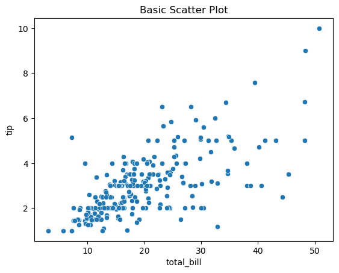
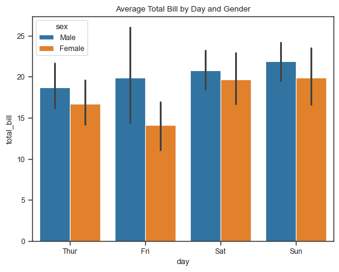
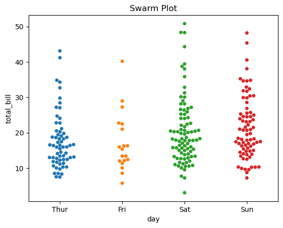

# Seaborn
Seaborn is a powerful and user-friendly Python data visualization library based on Matplotlib. It offers high-level functions for creating attractive and informative statistical graphics.

* Built on top of Matplotlib
* Works seamlessly with Pandas DataFrames
* Integrates with NumPy and SciPy
* Automatically handles aesthetics and themes


```python
# Install Seaborn (if not already installed)
# pip install seaborn

import seaborn as sns
import matplotlib.pyplot as plt
import pandas as pd
import numpy as np

# Sample dataset
df = sns.load_dataset("tips")
df.head()
```


<div>
<style scoped>
    .dataframe tbody tr th:only-of-type {
        vertical-align: middle;
    }

    .dataframe tbody tr th {
        vertical-align: top;
    }

    .dataframe thead th {
        text-align: right;
    }
</style>
<table border="1" class="dataframe">
  <thead>
    <tr style="text-align: right;">
      <th></th>
      <th>total_bill</th>
      <th>tip</th>
      <th>sex</th>
      <th>smoker</th>
      <th>day</th>
      <th>time</th>
      <th>size</th>
    </tr>
  </thead>
  <tbody>
    <tr>
      <th>0</th>
      <td>16.99</td>
      <td>1.01</td>
      <td>Female</td>
      <td>No</td>
      <td>Sun</td>
      <td>Dinner</td>
      <td>2</td>
    </tr>
    <tr>
      <th>1</th>
      <td>10.34</td>
      <td>1.66</td>
      <td>Male</td>
      <td>No</td>
      <td>Sun</td>
      <td>Dinner</td>
      <td>3</td>
    </tr>
    <tr>
      <th>2</th>
      <td>21.01</td>
      <td>3.50</td>
      <td>Male</td>
      <td>No</td>
      <td>Sun</td>
      <td>Dinner</td>
      <td>3</td>
    </tr>
    <tr>
      <th>3</th>
      <td>23.68</td>
      <td>3.31</td>
      <td>Male</td>
      <td>No</td>
      <td>Sun</td>
      <td>Dinner</td>
      <td>2</td>
    </tr>
    <tr>
      <th>4</th>
      <td>24.59</td>
      <td>3.61</td>
      <td>Female</td>
      <td>No</td>
      <td>Sun</td>
      <td>Dinner</td>
      <td>4</td>
    </tr>
  </tbody>
</table>
</div>


## Line plot
Trend over continuous interval (e.g., time).


```python
# Generate sample data
np.random.seed(42)
date_range = pd.date_range(start="2023-01-01", periods=30)
visits = np.random.poisson(lam=300, size=30)

web_df = pd.DataFrame({"date": date_range, "visits": visits})

# Line plot (time series)
sns.lineplot(data=web_df, x="date", y="visits")
plt.title("Website Traffic Over Time")
plt.xticks(rotation=45)
plt.tight_layout()
plt.show()
```


    

    


### Aggregated Line Plot by Category
Scenario: Average total bill by day of the week (from the tips dataset).


```python
tips = sns.load_dataset("tips")
# Plot average total bill for each day
sns.lineplot(x="day", y="total_bill", data=tips, estimator='mean', ci=None)
plt.title("Average Total Bill by Day")
plt.show()
```


    

    


You're summarizing data across days. There's a natural order (weekdays), and the mean creates smooth trends.

### Themes and Styles


```python
sns.set_style("whitegrid")  # Other options: white, dark, darkgrid, ticks
sns.set_context("notebook") # Others: paper, talk, poster
```


```python
sns.lineplot(x="day", y="total_bill", data=tips, estimator='mean', ci=None)
sns.set_style("ticks")
sns.set_context("poster")
plt.title("Line plot with hue and style")
plt.show()
```


    

    


### Line Plot by Time of Day
Scenario: Tracking average tip amount across different table sizes during lunch/dinner.


```python
sns.lineplot(x="size", y="tip", hue="time", data=tips, estimator="mean")
plt.title("Average Tip vs. Party Size by Time of Day")
sns.set_context("paper")
plt.show()
```


    

    


 Size is ordered numerically, and you’re summarizing trends.

### Line Plot for Product Sales Over Time
Scenario: Product A vs B sales across quarters.


```python
quarters = ['Q1', 'Q2', 'Q3', 'Q4']
sales_a = [150, 200, 250, 300]
sales_b = [100, 180, 220, 280]

sales_df = pd.DataFrame({
    "quarter": quarters * 2,
    "sales": sales_a + sales_b,
    "product": ["A"] * 4 + ["B"] * 4
})

sns.lineplot(data=sales_df, x="quarter", y="sales", hue="product", marker="o")
plt.title("Quarterly Sales of Products A and B")
plt.show()
```


    

    


Quarter is ordinal, and comparing two products' performance makes sense over a line.

### Stock Price or Sensor Data (Simulated)
Scenario: Temperature measured hourly.


```python
hours = list(range(0, 24))
temperature = [20 + np.sin(h/24 * 2 * np.pi) * 10 + np.random.randn()*0.5 for h in hours]

hourly_df = pd.DataFrame({"hour": hours, "temperature": temperature})

sns.lineplot(data=hourly_df, x="hour", y="temperature")
plt.title("Hourly Temperature Variation")
plt.xticks(hours)
plt.grid(True)
plt.show()
```


    

    


## Scatter plot
 Bivariate relationship between continuous variable
 


```python
sns.scatterplot(x='total_bill', y='tip', data=df)
plt.title("Basic Scatter Plot")
plt.show()
```


    

    


### Scatter Plot with hue (Color Encoding)


```python
sns.scatterplot(x='total_bill', y='tip', hue='sex', data=df)
plt.title("Scatter Plot with Multiple Encodings")
plt.show()
```


    

    


### Scatter Plot with style (Marker Shape)
Differentiate smokers vs non-smokers.


```python
sns.scatterplot(x="total_bill", y="tip", hue="sex", style="smoker", data=df)
plt.title("Scatter Plot with Hue and Style")
plt.show()
```


    

    


### Scatter Plot with size (Bubble Size)
Represent party size with marker size.


```python
sns.scatterplot(x="total_bill", y="tip", size="size", data=df, sizes=(20, 200))
plt.title("Scatter Plot with Size Encoding")
plt.show()
```


    

    


### Scatter Plot with hue, size, and style
Multivariate relationships in one plot.


```python
sns.scatterplot(x="total_bill", y="tip", hue="sex", style="smoker", size="size", data=df)
plt.title("Multivariate Scatter Plot (Hue, Style, Size)")
plt.show()
```


    

    


## Bar Plot

Aggregate comparison (mean by default).


```python
sns.barplot(x='day', y='total_bill', data=df)
plt.title("Average Total Bill per Day")
plt.show()
```


    

    


### With custom estimator:


```python
from numpy import median
sns.barplot(x='day', y='total_bill', estimator=median, data=df)
plt.title("Median Total Bill per Day")
plt.show()
```


    

    


### Grouped Bar Plot
Compare average total bill by gender across days.


```python
sns.barplot(x="day", y="total_bill", hue="sex", data=df)
plt.title("Average Total Bill by Day and Gender")
plt.show()
```


    

    


### Horizontal Bar Plot
Scenario: When labels are long or easier to read sideways.


```python
sns.barplot(x="total_bill", y="day", data=df)
plt.title("Average Total Bill (Horizontal)")
plt.show()
```


    

    


#### Custom Color Palette
Use corporate or thematic colors.


```python
palette = ["#FF6F61", "#6B5B95", "#88B04B", "#F7CAC9"]
sns.barplot(x="day", y="total_bill", data=df, palette=palette)
plt.title("Bar Plot with Custom Colors")
plt.show()
```


    

    


```python
ax = sns.barplot(x="day", y="total_bill", data=df)
for container in ax.containers:
    ax.bar_label(container, fmt="%.1f", padding=3)
plt.title("Bar Plot with Value Labels")
plt.show()
```


    

    


## Count Plot

Count of observations per category.


```python
sns.countplot(x='day', data=df)
plt.title("Count of Days")
plt.show()
```


    

    


## Hisotgram


```python
sns.histplot(data=df, x="total_bill", bins=10, color="skyblue", edgecolor="black")
plt.title("Histogram of Total Bill")
plt.show()
```


    

    


### Histogram with KDE (Density Curve)
Show smooth distribution estimate with histogram


```python
sns.histplot(data=df, x="total_bill", kde=True, color="lightgreen", edgecolor="black")
plt.title("Histogram with KDE Curve")
plt.show()
```


    

    


### Histogram (displot)

Distribution of a single variable.


```python
sns.displot(df['total_bill'], kde=False, bins=15)
plt.title("Histogram of Total Bills")
plt.show()
```


    

    


### KDE Plot (Density Plot)

Smoothed distribution estimate.


```python
sns.kdeplot(data=df['total_bill'], fill=True)
plt.title("KDE of Total Bill")
plt.show()
```


    

    


### Histogram by Category (hue)
Compare distributions of total bill for males and females.


```python
sns.histplot(data=df, x="total_bill", hue="sex", kde=True, palette="Set2")
plt.title("Total Bill Distribution by Gender")
plt.show()
```


    

    


### Multiple Distributions (Separate Histogram per Category)
One histogram per gender using col.


```python
g = sns.displot(data=df, x="total_bill", col="sex", kde=True, bins=15)
g.fig.suptitle("Histogram by Gender", y=1.05)
plt.show()
```


    

    


### Stacked Histogram
Total bill distribution by smoking status.


```python
sns.histplot(data=df, x="total_bill", hue="smoker", multiple="stack", palette="pastel")
plt.title("Stacked Histogram by Smoker")
plt.show()
```


    

    


### Grouped Histogram (Side-by-Side)
Compare total bill distribution by time of day.


```python
sns.histplot(data=df, x="total_bill", hue="time", multiple="dodge", bins=15)
plt.title("Grouped Histogram by Time")
plt.show()
```


    

    


### Cumulative Histogram
How many people tipped less than X dollars?


```python
sns.histplot(data=df, x="tip", cumulative=True, bins=20, color="orchid", edgecolor="black")
plt.title("Cumulative Histogram of Tips")
plt.show()
```


    

    


### Histogram with Log Scale
For data that is heavily skewed or spans several magnitudes.


```python
sns.histplot(data=df, x="total_bill", log_scale=True, color="coral", bins=15)
plt.title("Histogram with Log Scale")
plt.show()
```


    

    


### Horizontal Histogram
When x-axis labels are long or categorical.


```python
sns.histplot(data=df, y="total_bill", bins=15, color="slateblue")
plt.title("Horizontal Histogram")
plt.show()
```


    

    


### Histogram with Custom Bin Size and Range
Fine-tuned binning.


```python
sns.histplot(data=df, x="total_bill", bins=np.arange(0, 60, 5), color="steelblue")
plt.title("Histogram with Custom Bin Width")
plt.show()
```


    

    


## Box Plot

Summary of distribution (median, IQR, outliers).


```python
sns.boxplot(x='day', y='total_bill', data=df)
plt.title("Boxplot of Total Bill by Day")
plt.show()
```


    

    


### Box plot with hue:


```python
sns.boxplot(x='day', y='total_bill', hue='sex', data=df)
plt.title("Boxplot by Day and Gender")
plt.show()
```


    

    


### Horizontal Box Plot
Better readability for long labels.


```python
sns.boxplot(y="day", x="total_bill", data=df)
plt.title("Horizontal Box Plot")
plt.show()
```


    

    


### Box Plot with Custom Color Palette
Use brand or thematic color schemes.


```python
sns.boxplot(x="day", y="total_bill", data=df, palette="Set2")
plt.title("Box Plot with Custom Palette")
plt.show()
```


    

    


### Box Plot with Multiple Variables (Faceted)
Separate plots by gender.


```python
g = sns.catplot(x="day", y="total_bill", kind="box", col="sex", data=df)
g.fig.suptitle("Box Plot Faceted by Gender", y=1.05)
plt.show()
```


    

    


### Box Plot of Continuous vs. Continuous Variable (Binned)
Scenario: Convert continuous variable to categorical for box plotting.


```python
df["bill_bin"] = pd.cut(df["total_bill"], bins=[0, 10, 20, 30, 50])
sns.boxplot(x="bill_bin", y="tip", data=df)
plt.title("Tip Distribution by Binned Total Bill")
plt.xticks(rotation=45)
plt.show()
```


    

    


### Box Plot with Outlier Customization
Customize appearance of outliers.


```python
sns.boxplot(x="day", y="total_bill", data=df,
            flierprops=dict(marker='o', markerfacecolor='red', markersize=8))
plt.title("Box Plot with Custom Outliers")
plt.show()
```


    

    


### Combined Box and Strip Plot
Show box summary and all individual points.


```python
sns.boxplot(x="day", y="total_bill", data=df, palette="pastel")
sns.stripplot(x="day", y="total_bill", data=df, color='black', jitter=True, size=3)
plt.title("Box + Strip Plot")
plt.show()
```


    

    


###  Box Plot + Swarm Plot
Combine summary with non-overlapping raw data.


```python
sns.boxplot(x="day", y="total_bill", data=df, palette="cool")
sns.swarmplot(x="day", y="total_bill", data=df, color=".25", size=3)
plt.title("Box + Swarm Plot")
plt.show()
```


    

    


## Violin Plot

Use Case: Combination of box and KDE.


```python
sns.violinplot(x='day', y='total_bill', data=df)
plt.title("Violin Plot of Total Bill by Day")
plt.show()
```


    

    


## Strip Plot

Display all data points (adds jitter).


```python
sns.stripplot(x='day', y='total_bill', data=df, jitter=True)
plt.title("Strip Plot")
plt.show()
```


    

    


## Swarm Plot

Better layout than strip for small data.


```python
sns.swarmplot(x='day', y='total_bill', data=df)
plt.title("Swarm Plot")
plt.show()
```


    

    


## Pair Plot

Pairwise relationships in dataset.


```python
sns.pairplot(df[['total_bill', 'tip', 'size']], kind='scatter')
plt.suptitle("Pair Plot", y=1.02)
plt.show()
```


    

    


## Heatmap

Use Case: Visualizing correlation or matrix.


```python
correlation = df.corr()
sns.heatmap(correlation, annot=True, cmap='coolwarm')
plt.title("Heatmap of Correlations")
plt.show()
```


    

    


## FacetGrid/Catplot

Multi-panel plots for subgroup comparisons.


```python
g = sns.FacetGrid(df, col="sex", row="smoker")
g.map(sns.histplot, "total_bill")
plt.show()
```


    

    


```python
g = sns.catplot(x="day", y="tip", col="sex", data=df, kind="box")
g.fig.suptitle("Tip Distribution by Gender", y=1.05)
plt.show()
```


    

    


## Regression Plot (lmplot)

Linear regression + scatter.


```python
sns.lmplot(x='total_bill', y='tip', data=df, hue='sex')
plt.title("Linear Regression of Tip vs Bill")
plt.show()
```


    

    


## Joint Plot

 Bi-variate plot + marginal histograms.


```python
sns.jointplot(x='total_bill', y='tip', data=df, kind='hex')
plt.suptitle("Joint Plot: Total Bill vs Tip", y=1.02)
plt.show()
```


    

    


## Area chart


```python
# Create time series data
np.random.seed(42)
days = pd.date_range(start="2023-01-01", periods=30)
revenue = np.random.normal(loc=200, scale=20, size=30)

df = pd.DataFrame({"day": days, "revenue": revenue})

# Line + Area chart
sns.lineplot(x="day", y="revenue", data=df, color="blue")
plt.fill_between(df["day"], df["revenue"], color="blue", alpha=0.3)
plt.title("Daily Revenue (Area Chart)")
plt.xticks(rotation=45)
plt.tight_layout()
plt.show()
```


    

    


### Multiple Series Stacked Area Chart


```python
# Create sample data
days = pd.date_range("2023-01-01", periods=10)
product_a = np.random.randint(20, 50, size=10)
product_b = np.random.randint(10, 40, size=10)
product_c = np.random.randint(5, 30, size=10)

# Stack manually
product_df = pd.DataFrame({
    "day": days,
    "Product A": product_a,
    "Product B": product_b,
    "Product C": product_c
})

# Plot stacked area chart
plt.stackplot(product_df["day"],
              product_df["Product A"],
              product_df["Product B"],
              product_df["Product C"],
              labels=["Product A", "Product B", "Product C"],
              colors=sns.color_palette("Set2", 3),
              alpha=0.7)

plt.legend(loc='upper left')
plt.title("Stacked Area Chart: Product Sales")
plt.xticks(rotation=45)
plt.tight_layout()
plt.show()
```


    

    


### Area Chart by Category (Group-wise Shading)


```python
df = sns.load_dataset("tips")
tip_df = df.groupby("size", as_index=False)["tip"].mean()

# Line + fill for group-based area
sns.lineplot(x="size", y="tip", data=tip_df, color="purple")
plt.fill_between(tip_df["size"], tip_df["tip"], color="purple", alpha=0.4)
plt.title("Average Tip by Party Size (Area Chart)")
plt.xlabel("Party Size")
plt.ylabel("Average Tip ($)")
plt.show()
```


    

    


### Gradient-style Area Chart (Smooth Look)
Smooth trend of weight loss.


```python
days = np.arange(1, 31)
weight = 80 - (np.linspace(0, 10, 30) + np.random.randn(30))

# Line + smooth area
sns.lineplot(x=days, y=weight, color="teal")
plt.fill_between(days, weight, color="teal", alpha=0.3)
plt.title("Weight Loss Progress")
plt.xlabel("Day")
plt.ylabel("Weight (kg)")
plt.show()
```


    

    


## Boxen Plot (for large data)
Like a boxplot but with more quantiles.


```python
sns.boxenplot(x="day", y="total_bill", data=sns.load_dataset("tips"))
plt.title("Boxen Plot of Total Bill by Day")
plt.show()
```


    

    


### Saving Plots


```python
plt.savefig("my_plot.png", dpi=300, bbox_inches='tight')
```


    <Figure size 640x480 with 0 Axes>

